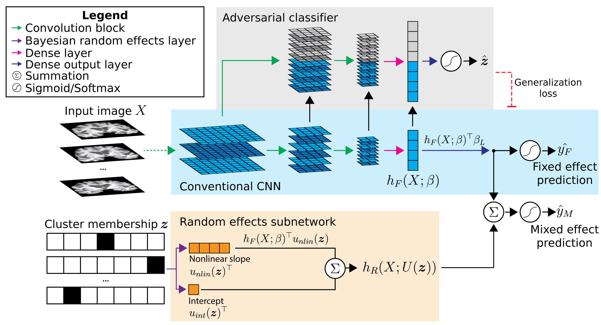

# Alzheimer's Disease diagnosis from T1-weighted MRI

In this application of MEDL, we classify individuals into Alzheimer's Disease or cognitively normal based on their structural MRI. Specifically, we acquire 2D coronal slices through the right hippocampus and train a CNN classifier. Data is sourced from the ADNI2 and ADNI3 datasets. Mixed effects modeling is incorporated into the CNN to capture the differences between study sites, including variations across scanner models, manufacturers, and acquisition parameters. 

## Data preprocessing

1. Image selection: `select_images_dx.ipynb` performs some dataset curation and selects good-quality images from the ADNI2 and ADNI3 datasets. It generates a .csv file containing image information and an sMRI_input_files.csv file for use with the DLLabPipeline.

2. Preprocessing pipeline: Run DLLabPipeline using the config_ADNI23_sMRI.ini and the previously generated sMRI_input_files.csv. 

3. Get cross-hippocampal coronal slices: `preproc_extract_hippo_slices.py` extracts a coronal slice through the right hippocampus from each preprocessed image. The slices are saved as .png files.

4. Partition data into train/validation/test/heldout sites: `png_to_numpy_data_splits.py` selects a number of sites to include for further analyses. Monte Carlo random splitting is used to generate train/validation/test partitions and save as .npz Numpy files. Data from the remaining, heldout sites is reserved for evaluating model generalization performance to sites unseen during training. 

## Models
`main.py` is the main script for training and evaluating models. It should be run from the command line, passing in arguments for the selected model type and data path. For example:
```
python main.py --model_type mixedeffects --data_dir /path/to/data/splits
```
See `python main.py --help` for arguments and the section below for model types. 

Use `gradcam_comparison.ipynb` to generate GradCAM feature visualization figures. 

`infer_z_unseen_sites.py` trains a basic CNN to predict an image's cluster membership. This is used to infer the cluster membership design matrix Z for each unseen site, allowing the ME-CNN to apply its learned random effects to this data. 

## Model details



* $`X`$: 2D image input
* $`z`$: design matrix containing one-hot encoded cluster membership of each sample
* $`\hat{y}_F`$: fixed effects-based classification prediction
* $`\hat{y}_M`$: mixed effects-based classification prediction
* $`\beta`$: fixed effects subnetwork weights
* $`h_F(X; \beta)`$: latent output from penultimate dense layer

Adversarial clasifier: 
* $`\hat{z}`$: predicted cluster membership

Random effects subnetwork:
* $`U(z)`$: cluster-specific weights, regularized to a zero-mean normal prior
* $`h_R(X; U(z))`$: random effects subnetwork output

### Conventional CNN
`--model_type conventional`
A classic convolutional neural network with 7 convolution blocks (convolution -> batch normalization -> PReLU -> max pooling) and two final dense layers. See blue area in diagram above.

### Cluster input CNN
`--model_type clusterinput`
A "naive" approach to incorporating cluster membership into the CNN, where $`Z`$ is concatenated into the model before the penultimate dense layer ($`h_F(X; \beta)`$ in diagram above).

### Domain adversarial CNN
`--model_type adversarial`
Domain adversarial CNN which adds an adversarial classifier (gray area in diagram). This adversary tries to predict the cluster membership of each sample based on the layer outputs of the main CNN. At the same time, the main CNN tries to increase the crossentropy of the adversary by learning features that are not predictive of cluster membership. The result is a classifier that learns the prediction task using features minimally associated with cluster effects. 

### Mixed effects CNN
`--model_type mixedeffects`
Mixed effects CNN which builds upon the domain adversarial CNN. A random effects subnetwork (orange area in diagram) is added which takes the cluster membership $`Z`$ as an input and applies a cluster-specific scalar to $`h_F(X; \beta)`$ and produces a cluster-specific bias. These are added to the fixed effects subnetwork output before the final sigmoid activation. 
