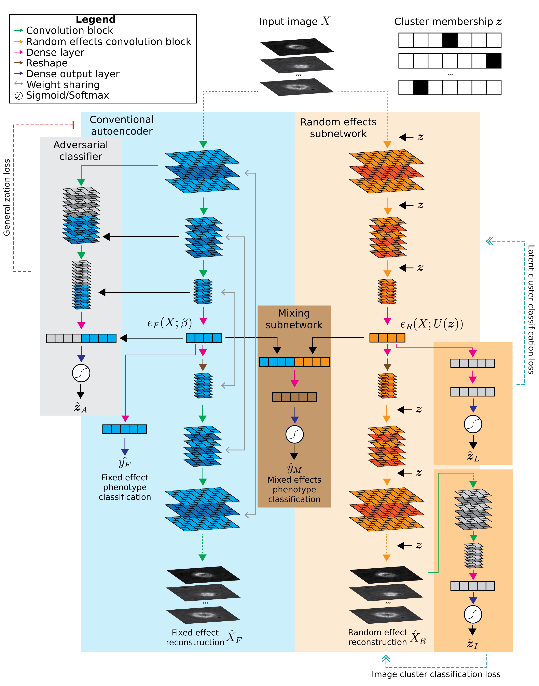

# Live cell image compression and classification
This application of MEDL uses an autoencoder-classifier (AEC) to compress cell images into a vector representation while also classifying their phenotype. 

Images of cells from melanoma patient-derived xenografts (PDXs) were provided by the Danuser lab. The dataset includes 7 PDXs, with 3 labeled as "high metastatic efficiency" and 4 labeled as "low metastatic efficiency" based on experimental observations. The classification task is to predict is whether each cell came from a PDX with high or low metastatic efficiency. Cells were imaged across several days, which creates a batch effect

## Data preparation
`create_dataset.py` selects images from 7 PDXs across several dates (batches) for inclusion, then divides into training/validation/test sets. The remaining dates are heldout as "unseen batches" to evaluate model generalization. The images and associated labels are saved as compressed .npz files to be loaded into memory when training models. (Unfortunately, disk read speed is too slow to efficiently stream .png files from disk during training using an ImageDataGenerator.)

## Model training
Call `main.py` to train a desired model type. Model types include:
* Conventional AEC: no explicit modeling of fixed or random effects
* Domain adversarial AEC: uses domain adversarial learning to enforce learning of batch-agnostic features, i.e. fixed effect features
* Domain enhancing (random effects) AEC: emphasizes batch-specific features, i.e. random effect features
* Mixed effects AEC: Combines components of the domain adversarial and domain enhancing models. (work in progress)

See [model details](#model-details) below.

For example, to train the conventional AEC:
```
python main.py --model_type conventional --output_dir <output location> 
    --training_metadata <datadir>/data_train.csv --training_data <datadir>/data_train.npz 
    --val_metadata <datadir>/data_val.csv --val_data <datadir>/data_val.npz 
```

If the data path arguments are not given, it will default to some preset locations (see `python main.py --help`). Note that all paths can be given relative to the `RESULTSDIR` and `DATADIR` global variables set in the `settings.py` file. They will automatically be expanded. 

Next, to evaluate the trained model on test data:
```
python main.py --model_type conventional --output_dir <output location> --do_test
    --test_metadata <datadir>/data_test.csv --test_data <datadir>/data_test.npz 
    --load_weights_epoch <epoch from which to load weights>
```

Similarly, to evaluate on data from heldout batches:
```
python main.py --model_type conventional --output_dir <output location> --do_test
    --test_metadata <datadir>/data_unseen.csv --test_data <datadir>/data_unseen.npz 
    --load_weights_epoch <epoch from which to load weights>
```

## Utilities
To run inference on trained models and obtain latent representations, reconstructions, or classifications, use `model_tools.py`. See `python model_tools.py --help` for arguments. 

For example, to compute classification predictions on a trained conventional AEC:
```
python model_tools.py --image_data <datadir>/data_*.npz --image_list <datadir>/data_*.csv 
    --weights <weights path.h5> --model_type conventional --classifications <outputpath.csv>
```

Use the `--latents` or `--reconstructions` arguments to output latent representations or reconstructions. Classifications are saved as .csv files, latents as .pkl Pandas DataFrame files, and reconstructions as .npy files. 

## Inferring the cluster membership design matrix for unseen batches
To fully utilize the random effects AEC on batches *not* seen during training, we need to infer the design matrix Z for images from these unseen batches. `infer_design_matrix.py` trains a convolutional classifier that predicts Z from from each image, using training data from the seen batches. It then predicts Z for the unseen batch data. Since the classifier uses a multi-class softmax output, the resulting inferred Z will contain the probabilistic weighting of similar seen sites for each unseen batch image.

## Model details



* $`X`$: 2D image input
* $`z`$: design matrix containing one-hot encoded cluster membership of each sample
* $`e_F(X; \beta)`$: latent representation from fixed effects encoder
* $`\hat{X}_F`$: fixed effects-based reconstructed image
* $`\hat{y}_F`$: fixed effects-based classification prediction
* $`\hat{y}_M`$: mixed effects-based classification prediction
* $`\beta`$: fixed effects subnetwork weights

Adversarial clasifier: 
* $`\hat{z}_A`$: predicted cluster membership

Random effects subnetwork:
* $`U(z)`$: cluster-specific weights, regularized to a zero-mean normal prior
* $`e_R(X; U(z))`$: latent representation from random effects encoder
* $`\hat{X}_R`$: random effects-based reconstructed image
* $`\hat{z}_L`$: predicted cluster membership from latents
* $`\hat{z}_I`$: predicted cluster membership from random effect-based reconstruction

### Conventional AEC
`--model_type conventional`
A classic convolutional neural network corresponding to the blue area in diagram above.

### Domain adversarial CNN
`--model_type adversarial`
Domain adversarial AEC which adds an adversarial classifier (gray area in diagram). This adversary tries to predict the cluster membership of each sample based on the layer outputs of the main CNN. At the same time, the main AEC tries to increase the crossentropy of the adversary by learning features that are not predictive of cluster membership. 

### Mixed effects AEC
`--model_type mixedeffects`
Mixed effects AEC which builds upon the domain adversarial AEC. A mirrored random effects subnetwork (orange area in diagram) is added to learn cluster-specific features. It takes the cluster membership $`z`$ as an input and applies a cluster-specific scalar and cluster-specific bias to the output of each convolutional block. 
